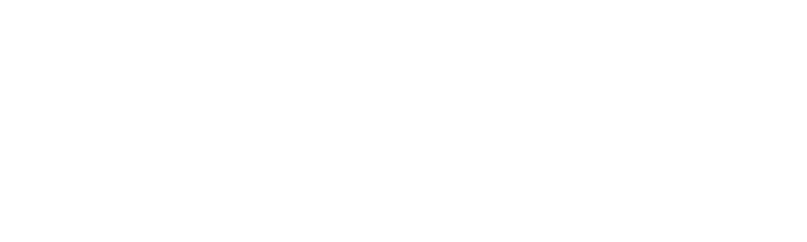

<p align="center"></p>

<a href="https://skuqre.github.io/nikke-font-generator"><h2 align="center">Barely Accurate NIKKE Font Generator</h2></a>
<p align="center">
<a href="https://skuqre.github.io/nikke-font-generator/usage/">Usage Guidelines</a> -
<a href="https://skuqre.github.io/nikke-font-generator/credits/">Site Credits</a> - 
<a href="https://skuqre.github.io/nikke-font-generator/update-log/">Site Updates</a>
</p>

It's a barely accurate NIKKE Font generator!

With a canvas and a dream, you can create anything you'd like!

## Building
```
npm i
npm run dev
```

The "meat" of the site is in `src\scripts`. `.astro` files are HTML files. I've rewrote the UI and it's much more consistent now!

Made with [Astro](https://astro.build).